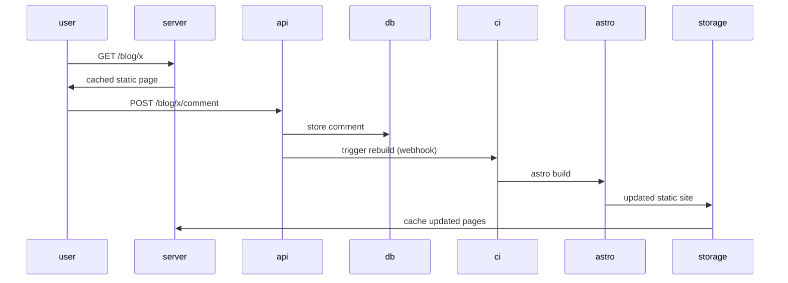
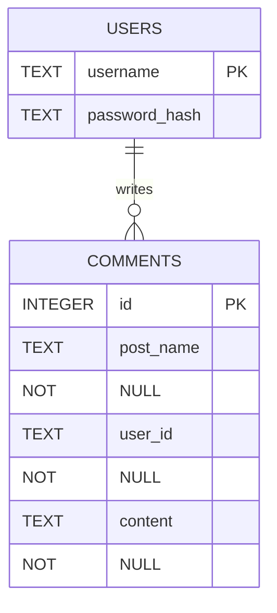

# bengodfrey.dev - build log

# Astro project creation

After coming to my decision around frontend framework, I put together my Astro project. This was fairly easy. There is a "Getting Started" section on their website, most of the code is just standard html, with a bit of React-like component crafting. With a small amount of googling, I have a wireframe which I am happy with.

## Architecture

The architecture I want to aim for is along these lines:



As such, I will be calling on astro exactly when the api's POST /blog/x/comment endpoint is hit.

Blog posts will not be created through the site itself, but rather through commits to the repo, so we don't need to worry about any sort of dynamic creation of files. We just need to have some logic in each blog post's page to go and fetch comments.

### Auth

I have skirted around the fact that I will most likely need some idea of auth for my api. This will help me with rate limiting - users can only comment when signed in, and a user can only comment once a minute or similar. With these rules in place I will only need to worry about rate limiting on the auth endpoints themselves.

How will I actually go about handling the auth then? That is the question. On this point, I will turn to my other guiding principle. Let's keep things simple. Specifically, let's keep things simple for me. I roughly understand tokens, whereas sessions are something I have not had to worry about before. I can handle auth by giving a token in return for some successful auth request. Since I do not really care about specifics of who is using the site, I can keep the tokens simple. Some signed variant of

```json
{
    username: xxx,
    expires: yyy
}
```

### Storage

In keeping with my simple and green approach, I have another clear winner when it comes to database. SQLite will give me everything I need. A place to persist small amounts of data, and a simple interface way of interacting with my api. My data can be modelled as follows



### API language

I am just about to take a new musical interlude while I go off and build my api. Before I make a start on this, however, I will make a quick call as to what language I should be using. Probably one of my last wee decisions to make. I have tried to go at things with an open mind so far on most decisions I have been making, but I would like to make a clear call on this one. I want to use a Go backend for this website. There are a couple of reasons for this:

- A compiled language like Go will align well with my green principle
    - Any Node backend which I might try to use will always end up being less efficient than Go
- I have not had much of a chance to use Go in the past, and I think it is a skill worth building.

Any questions? No? Good.

## Building my Backend

### Database foundations

I don't want to jump into building my backend as if it is one giant thing. I want to approach it in a few steps. Firstly, I want to initialise my database and write a couple of migrations.

As mentioned before, SQLite will suit my needs. I will need a driver for this. I will go ahead and install this with `go get github.com/mattn/go-sqlite3`. I can ensure that everything has been installed ok by trying to use this driver:

```go
package main

import (
	"database/sql"
	"log"

	_ "github.com/mattn/go-sqlite3"
)

func main() {
	db, err := sql.Open("sqlite3", "./backend.db")
	if err != nil {
		log.Fatal(err)
	}
	defer db.Close()
}
```

No red, we are happy. With this in place, we can start writing the migrations themselves. I will create `migrations/x.go` files, starting with `migrations/createUserTable.go`. This is, again, not too tricky yet:

```go
package migrations

import (
	"database/sql"
	"fmt"
	"log"
)

func CreateUserTable(db *sql.DB) {
	_, err := db.Exec(`CREATE TABLE IF NOT EXISTS users (
		username TEXT PRIMARY KEY,
		password_hash TEXT NOT NULL
	)`)
	if err != nil {
		log.Fatal(err)
	}
	fmt.Println("users table created")
}
```

Then I can import this into my `main.go` by adding "bengodfrey.dev/blog-backend/migrations" to my imports and calling `migrations.CreateUserTable(db)` in the main function. After running this I can see my db file created, so I think we are happy. I also wrote some tests, I'm not *that* sloppy.

I done the same as above for my comment table, because sometimes I am *that* sloppy.

### Server

A crucial part of handling my api requests will be having a server to do this on. From reading about Go, it seems that the standard way of doing this (or at least an easy way of doing this) is by writing some handler functions, and using these functions to handle some endpoint. At this point, my development has gone ahead of my writing so to save myself some time, and to save some digital chalk, I will break down one of my handlers:

```go
func (h *CommentHandler) GetComments(w http.ResponseWriter, r *http.Request) {

	postName := r.Header.Get("X-Post-Name")
	if postName == "" {
		http.Error(w, "Missing X-Post-Name header", http.StatusBadRequest)
		return
	}

	rows, err := h.DB.Query(
		"SELECT id, post_name, user_id, content FROM comment WHERE post_name = ?",
		postName,
	)
	if err != nil {
		http.Error(w, err.Error(), http.StatusInternalServerError)
		return
	}
	defer rows.Close()

	comments := []Comment{}
	for rows.Next() {
		var c Comment
		err := rows.Scan(&c.ID, &c.PostName, &c.UserID, &c.Content)
		if err != nil {
			http.Error(w, err.Error(), http.StatusInternalServerError)
			return
		}
		comments = append(comments, c)
	}

	if err = rows.Err(); err != nil {
		http.Error(w, err.Error(), http.StatusInternalServerError)
		return
	}

	w.Header().Set("Content-Type", "application/json")
	w.WriteHeader(http.StatusOK)
	if err := json.NewEncoder(w).Encode(comments); err != nil {
		return
	}
}
```

In this handler, I am grabbing a value from the headers (`X-Post-Name`), and querying the database to find comments which belong to the corresponding post. I then read the found rows, and create a list of Comments which is to be returned. If I come across any errors on the way, I wiwll handle them appropriately.

There is clearly a lot more detail that goes into writing the backend logic, but I am happy to skip it, as I am really just using fairly standard tools of the Go language.

## Stitching things together

I now have two things:

- An Astro-generated frontend
- A Go backend

Next, I need them to talk to each other. To achieve this, I will use nginx as a proxy - sending /api/* requests to my backend, and having other requests try to find some matching page. Now, in the name of simplicity, I am going to make another green sacrifice, albeit a small one. From my previous dealings with nginx, it is easier with docker. This is most probably down to a shortcoming in my own knowledge, and in time I should be more comfortable with bare metal installations, but for now, docker makes sense.

### dockerfile

I will first deal with our backend's docker logic. I currently have my backend logic in a /backend directory. I will copy this into a decently named place, and make sure there is some location (/app/data/backend.db) for my sqlite db file to live:

```dockerfile
FROM golang:1.26-alpine
WORKDIR /app
RUN mkdir -p /app/data
VOLUME /app/data

COPY backend/ ./backend/
RUN cd backend && CGO_ENABLED=0 GOOS=linux go build -o /main main.go
```

After this, we need to set up our pages. The Astro project is in /bengodfreydev, so as above we will copy this across. Once we have this, we can build the pages with the same `npm run build` command which I use locally. Note, I build these pages, **then** point nginx towards them. This achieves the whole "serve static pages" thing which I was looking for before.

```dockerfile
FROM node:22-alpine AS frontend-builder
WORKDIR /app

COPY bengodfreydev/package*.json ./
RUN npm ci

COPY bengodfreydev/ ./

RUN npm run build
```

Now we want to pull the parts of this together with our nginx container. The config here can be fairly simple, as long as we are getting our pages from and sending our api requests to the right place.

```
server {
    listen 80;
    server_name localhost;

    location / {
        root /usr/share/nginx/html;
        index index.html index.htm;
        try_files $uri $uri/ /index.html;
    }

    location /api/ {
        rewrite ^/api/(.*)$ /$1 break;
        proxy_pass http://127.0.0.1:8080;
        
        proxy_set_header Host $host;
        proxy_set_header X-Real-IP $remote_addr;
        proxy_set_header X-Forwarded-For $proxy_add_x_forwarded_for;
        proxy_set_header X-Forwarded-Proto $scheme;
    }
}
```

Then finally, we pull the pieces together and define an executable. We have our dockerfile:


```dockerfile
FROM golang:1.26-alpine AS backend-builder
WORKDIR /app
RUN mkdir -p /app/data
VOLUME /app/data

COPY backend/ ./backend/
RUN cd backend && CGO_ENABLED=0 GOOS=linux go build -o /main main.go

FROM node:22-alpine AS frontend-builder
WORKDIR /app

COPY bengodfreydev/package*.json ./
RUN npm ci

COPY bengodfreydev/ ./

RUN npm run build

FROM nginx:alpine
WORKDIR /app

COPY --from=backend-builder /main /app/main

COPY --from=frontend-builder /app/dist /usr/share/nginx/html

COPY nginx.conf /etc/nginx/conf.d/default.conf

RUN echo '#!/bin/sh' > /entrypoint.sh && \
    echo '/app/main &' >> /entrypoint.sh && \
    echo 'exec nginx -g "daemon off;"' >> /entrypoint.sh && \
    chmod +x /entrypoint.sh

EXPOSE 80
ENTRYPOINT ["/entrypoint.sh"]
```