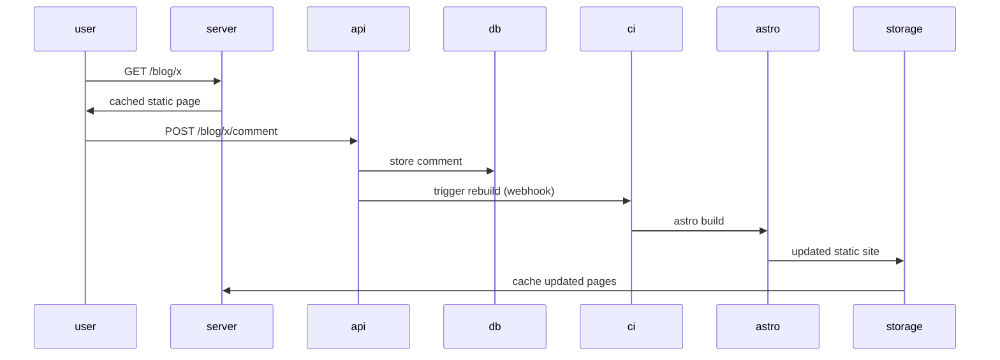
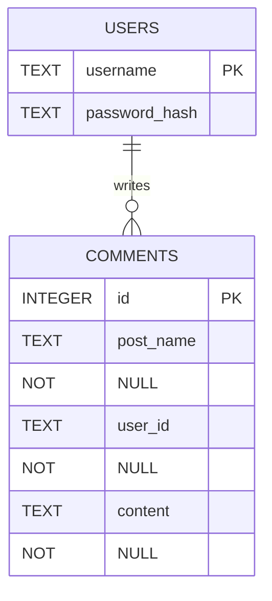

# bengodfrey.dev - build log

# Astro project creation

After coming to my decision around frontend framework, I put together my Astro project. This was fairly easy. There is a "Getting Started" section on their website, most of the code is just standard html, with a bit of React-like component crafting. With a small amount of googling, I have a wireframe which I am happy with.

## Architecture

The architecture I want to aim for is along these lines:



As such, I will be calling on astro exactly when the api's POST /blog/x/comment endpoint is hit.

Blog posts will not be created through the site itself, but rather through commits to the repo, so we don't need to worry about any sort of dynamic creation of files. We just need to have some logic in each blog post's page to go and fetch comments.

### Auth

I have skirted around the fact that I will most likely need some idea of auth for my api. This will help me with rate limiting - users can only comment when signed in, and a user can only comment once a minute or similar. With these rules in place I will only need to worry about rate limiting on the auth endpoints themselves.

How will I actually go about handling the auth then? That is the question. On this point, I will turn to my other guiding principle. Let's keep things simple. Specifically, let's keep things simple for me. I roughly understand tokens, whereas sessions are something I have not had to worry about before. I can handle auth by giving a token in return for some successful auth request. Since I do not really care about specifics of who is using the site, I can keep the tokens simple. Some signed variant of

```json
{
    username: xxx,
    expires: yyy
}
```

### Storage

In keeping with my simple and green approach, I have another clear winner when it comes to database. SQLite will give me everything I need. A place to persist small amounts of data, and a simple interface way of interacting with my api. My data can be modelled as follows



### API language

I am just about to take a new musical interlude while I go off and build my api. Before I make a start on this, however, I will make a quick call as to what language I should be using. Probably one of my last wee decisions to make. I have tried to go at things with an open mind so far on most decisions I have been making, but I would like to make a clear call on this one. I want to use a Go backend for this website. There are a couple of reasons for this:

- A compiled language like Go will align well with my green principle
    - Any Node backend which I might try to use will always end up being less efficient than Go
- I have not had much of a chance to use Go in the past, and I think it is a skill worth building.

Any questions? No? Good.

## Building my Backend

### Database foundations

I don't want to jump into building my backend as if it is one giant thing. I want to approach it in a few steps. Firstly, I want to initialise my database and write a couple of migrations.

As mentioned before, SQLite will suit my needs. I will need a driver for this. I will go ahead and install this with `go get github.com/mattn/go-sqlite3`. I can ensure that everything has been installed ok by trying to use this driver:

```go
package main

import (
	"database/sql"
	"log"

	_ "github.com/mattn/go-sqlite3"
)

func main() {
	db, err := sql.Open("sqlite3", "./backend.db")
	if err != nil {
		log.Fatal(err)
	}
	defer db.Close()
}
```

No red, we are happy. With this in place, we can start writing the migrations themselves. I will create `migrations/x.go` files, starting with `migrations/createUserTable.go`. This is, again, not too tricky yet:

```go
package migrations

import (
	"database/sql"
	"fmt"
	"log"
)

func CreateUserTable(db *sql.DB) {
	_, err := db.Exec(`CREATE TABLE IF NOT EXISTS users (
		username TEXT PRIMARY KEY,
		password_hash TEXT NOT NULL
	)`)
	if err != nil {
		log.Fatal(err)
	}
	fmt.Println("users table created")
}
```

Then I can import this into my `main.go` by adding "bengodfrey.dev/blog-backend/migrations" to my imports and calling `migrations.CreateUserTable(db)` in the main function. After running this I can see my db file created, so I think we are happy. I also wrote some tests, I'm not *that* sloppy.

I done the same as above for my comment table, because sometimes I am *that* sloppy.